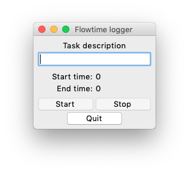

Flowtime logger
===============
A logger application based on the flowtime technique.

Flowtime logger is used for keeping a log of performed tasks and the work and break periods held during those tasks.

**This is a work in progress. Check the todo list on the bottom of this file to see what's still missing.**

For more information about the flowtime technique please visit:
https://medium.com/@lightsandcandy/the-flowtime-technique-7685101bd191

Requirements
-------------

- Python 3
- Tk 8.6 (included in the Python 3 binary installers for versions 3.7 and up from python.org)

To check your version of Tk launch the Python shell and type:

    import tkinter
    tkinter._test()

You can find more information on how to install Tk by going to https://tkdocs.com/tutorial/install.html and selecting "Python" from the dropdown menu on the right.

Quick start
-----------

 - To start the app, run flowtime_logger/flowtime_logger.py.
 - To start a task, type something into the description entry box and press the 'Start' button.
 - Press the 'Stop' button when you need to take a break or want to end the task.
 - Press the 'Continue' button if you want to continue after a break.
 - If you want to end the task, press the 'End' button (appears after pressing the 'Stop' button) or just close the program.
 - If you want to start a new task after ending the previous task, press the 'New' button.
 - Close the app by pressing the 'Quit' button

 Upon closing, the program will check that the current task is properly ended.
 If the task was not ended, the program will end it automatically and save it into the database.

 TODO
 ----

 - Create an interface to view the contents of the database.